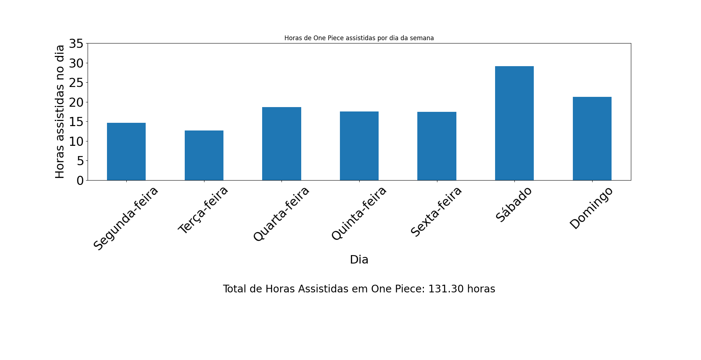
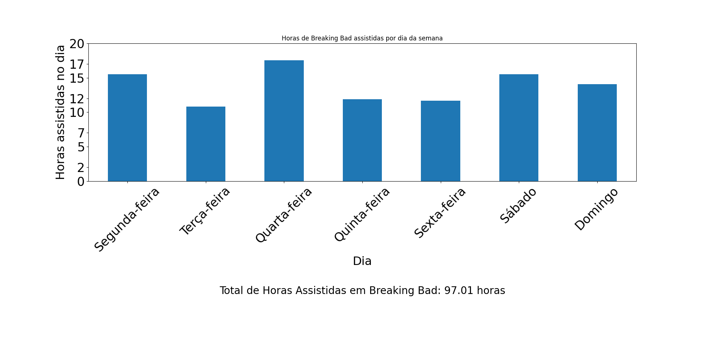

# Netflix Análise De Dados Pessoais

Este é um projeto simples de análise de dados da Netflix usando Python e a biblioteca Pandas. O objetivo é extrair informações úteis sobre o tempo gasto assistindo a séries específicas em um perfil.

## Pré-requisitos

- Python 3.x
- Pandas
- Matplotlib

## Instruções de Uso

1. Requisite e baixe seus dados da Netflix diretamente por [aqui](https://www.netflix.com/account/getmyinfo). (Pode demorar alguns dias para a entrega dos dados).
2. Substitua o arquivo `ViewingActivity.csv` pelo o seu arquivo.
3. Clone este repositório ou copie o código do script Python fornecido.
4. Abra o terminal e navegue até o diretório do projeto.
5. Execute o script Python digitando `python nome_do_script.py` no terminal.
6. Siga as instruções para inserir o nome da série desejada e o perfil a ser analisado.

## Observações:
Um arquivo `ViewingActivity.csv` de exemplo está indo junto caso você não queira usar o seu. Utilize o perfil "Luan" e como série você pode utilizar "Breaking Bad", "One Piece" e "Sherlock" como exemplo.
Você também pode alterar o código para exibir diferentes tipos de informações. 

## Funcionalidades

- Análise do tempo total gasto assistindo a uma série específica por dia da semana.
- Criação de gráficos de barras para visualização fácil.
- Exportação de dados analisados para um arquivo CSV.

